# Buy and Sell Auto

[Here is a link to the live project](https://buy-and-sell-auto.herokuapp.com/)

Buy and Sell Auto is a website for Buying and Selling Cars. It is created using a django framework.

<h2 class="center">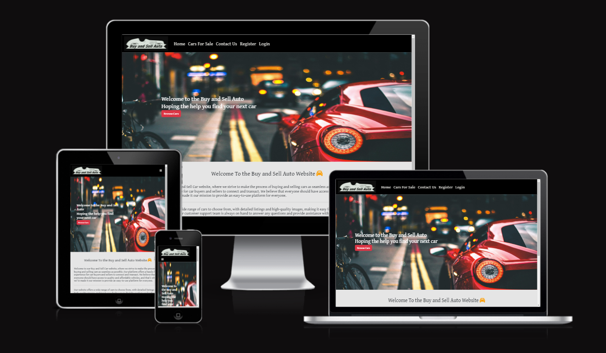</h2>

## Contents 

- [User Experience (UX)](#user-experience-ux)
   * [User Stories](#user-stories)
   
- [Design](#design)
   * [Colour Scheme](#colour-scheme)
   * [Typography](#typography)
   * [Imagery](#imagery)
   * [Wireframes](#wireframes)
   * [Database Schema](#database-schema)

- [Features](#features)

- [Technologies](#technologies)
   * [Languages used](#languages-used)
   * [Libraries & Programs Used](#libraries-and-programs-used)

- [Testing](#testing)
  
- [Deployment](#deployment)
   

- [Credits](#credits)
   * [Code](#code)

## User Experience (UX)
A User of the Buy and Sell Auto Page would be someone who is looking to buy or sell their car or cars. It could also be for someone who has an interest in cars and are looking to browse.

## User Stories 
#### EPIC | User Profile
- As a Site User I can register an account so that I can add/edit/delete my car post
- As a Site User i can create an account so that i can post an ad for a vehicle and comment under different vehicles 
- As a Site User, I can log in or log out of my account so that I can keep my account secure.

#### EPIC | User Navigation
- As a Site User I can see what the website is about and know if it is what i need. 
- As a Site User, I can easily navigate around the site and find what i need without any problems.
- As a Site User i can see contact information so that i can contact the person selling their vehicle
- As a Site User, I can view a paginated list of cars posted and i can select any car to view.
- As a Site User, I can click on a car post so that I can read the authors details, cars key info, description of car and view comments left by users. 
- As a Site User, I can contact the Site Administration about any problems i have.

#### EPIC | User Management
- As a Site User i can create, read, update and delete my individual ad so that i can improve my experience selling my vehicle 
- As a Site User, I can Edit my own Car Post so i dont need to start at the very beginner for changing details or errors.

#### EPIC | User Interaction
- As a site user/ admin i can view comments about an individual vehicle so that i can read the conversation about the vehicle
- As a site user i can click a vehicle posted  so that see the full description of vehicle 
- As a site user i can view a list of vehicles for sale so that i can select one to read about 
- As a Site User, I can Like another members post.
- As a Site User, I can comment on another members post and delete the post once site admin as approved it.

#### EPIC | Site Administration
- As a Site admin i can approve/disapprove ads so that i can filter offensive posts
- As a Site Admin i can create, read, update and delete posts so that i can manage and filter the ads on site
- As a Site Admin, I can view issues from the User

#### User stories not yet implemented
 
- As a Site User, I can search for the car i am looking for

- As a Site User, I can save cars in a file called favourites

- As a Site User, I can log in through my social media accounts such as Facebook,Instagram and Github.

- As a Site User, I can add multiply images so potential buyers can have a better view of the car

## Design

  The Design was to make it attractive for users of the site and to make it easy on the eye. 

### Colour Scheme
<h2 class="center">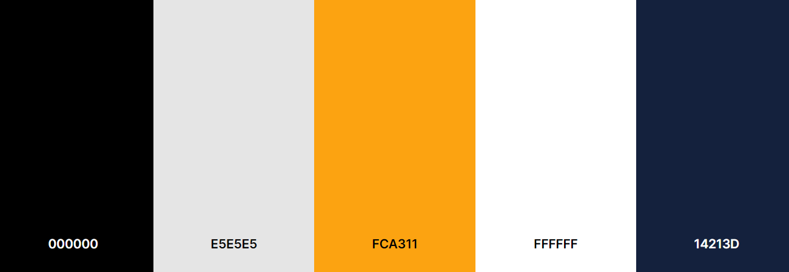</h2>

- I got these five colours from the website called [coolors](coolors.co)
- #000000. This was for the writing of the website.
- #E5E5E5. This was for the background of the website.
- #FCA311. This was for hovering over links eg. nav bar. 
- #FFFFFF. This is the color in forms and car details.
- #14213D. This was used in the masthead in car details.

### Typography
-  'Barlow', Is my main font. I believe it to be attractive for the page.
- 'sans-serif' was chosen as fallback font.

### Imagery
- The Logo and Hero Pic is the only static images displayed on the website. All other images will be posted by users.

### Wireframes
-   To View Home DeskTop click [here](docs/wireframes/home-desktop.png).
-   To View Home Ipad click [here](docs/wireframes/home-ipad.png).
-   To View Home Mobile click [here](docs/wireframes/home-mobile.png).
-   To View Add Car DeskTop click [here](docs/wireframes/addcar-desktop.png).
-   To View Add Car Ipad click [here](docs/wireframes/addcar-ipad.png).
-   To View Browse Cars DeskTop click [here](docs/wireframes/browse-car-desktop.png).
-   To View Browse Cars Mobile click [here](docs/wireframes/browse-cars-mobile.png).
-   To View Browse Cars Tablet click [here](docs/wireframes/browse-cars-tablet.png).
-   To View Car Detail DeskTop click [here](docs/wireframes/car-detail-desktop.png).
-   To View Car Detail Ipad click [here](docs/wireframes/car-detail-tablet.png).
-   To View Car Detail Mobile click [here](docs/wireframes/cardetail-mobile.png).

## Database Schema 

<h2 class="center">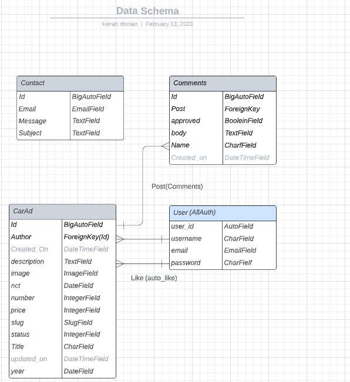</h2>

- I used principles of Object-Oriented Programming throughout this project and Django’s Class-Based Generic Views.

- Django AllAuth was used for the user authentication system.

- The Three Custom Models Used are CarAd, Comment and Contact

# Features

## Home Page

### Logo 

<h2 class="center"></h2>

- This is the logo of the site

 ### Navigation bar

<h2 class="center"></h2>

- When Logged In. Navigation bar consists of Logo, Home Page, Cars For Sale, Contact Us Page, Add Car Page, Log Out

-   When Logged Out. Navigation bar consists of Logo, Home Page, Cars For Sale, Contact Us Page, Add Car Page,
Register, Log In.

### Hero Image
<h2 class="center"></h2>

- Consist of Hero Pic. and text on the left with a button to browse cars.

### Welcome
<h2 class="center">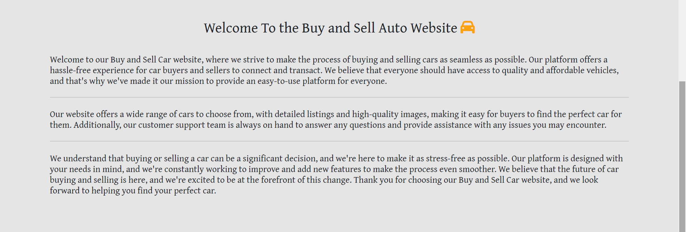</h2>

-   A welcome text about the website

### Footer

<h2 class="center"></h2>

-   A simple footer that has a background of black and orange writing.

-   It has the Creators name and also social media links that opening in a new tab.

## Browse Cars
<h2 class="center">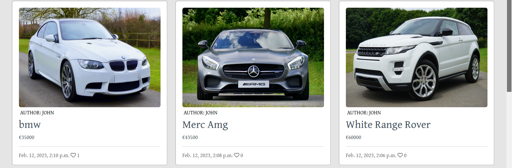</h2>

- Consists of all cars on the page and there is also a paginated function if there is too many cars.

- User can click into any car to see its features

## Car Detail

 ### Car Detail Header
<h2 class="center"></h2>

- Shows image of car along with name of car, creator and when was it posted.

 ### Car Detail Key Information
<h2 class="center">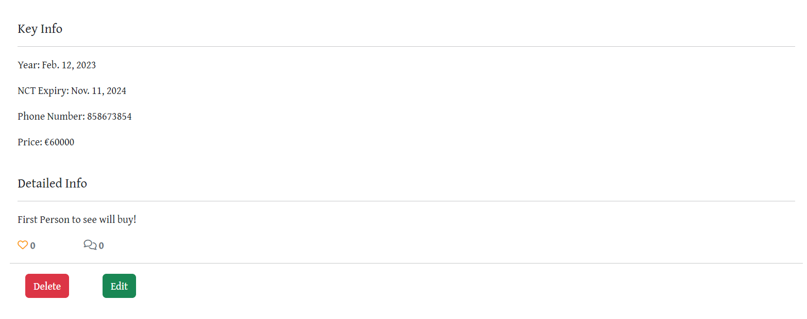</h2>

- Shows Key information such as Year,Nct, Phone Number, Price and description. 

- Can also see how many likes and comments it has on the post. 

- If this is the users post they can also edit the post or delete it.

 ### Car Detail Comments
<h2 class="center">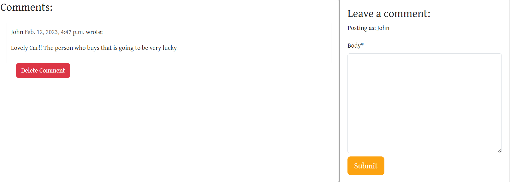</h2>

- This area shows the comments on the left.

- If signed in users can also comment which is showing on the right. 

- When comment is sent it will be approved by the admin. Once this is done the User can delete comment if they wish to do so.

## Accounts
 ### Register Page
<h2 class="center">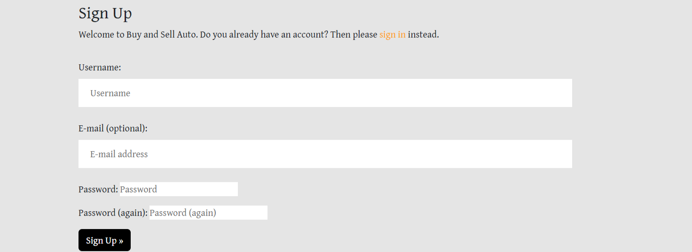</h2>
 
 - A Register Page to sign up to the website so the user can add comments and cars.

 - Created with the helping hand of Code Insitute walk through.

 ### Login Page
<h2 class="center">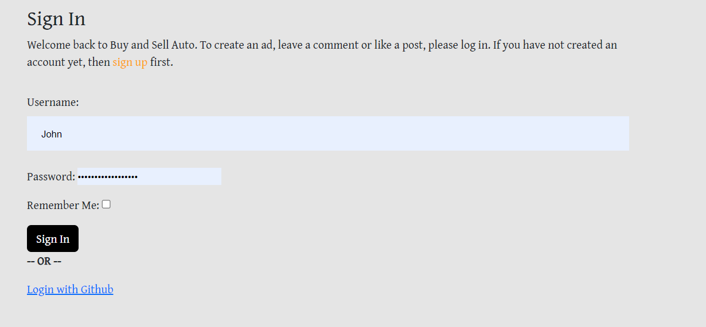</h2>

-   Sign in Page.

-   Ignore the sign in with github. Could not add feature and ran out of time to debug.

 ### Log out Page
<h2 class="center">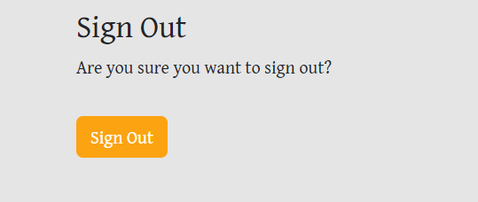</h2>

 To log out of the site.

 ### Features to add Car
<h2 class="center">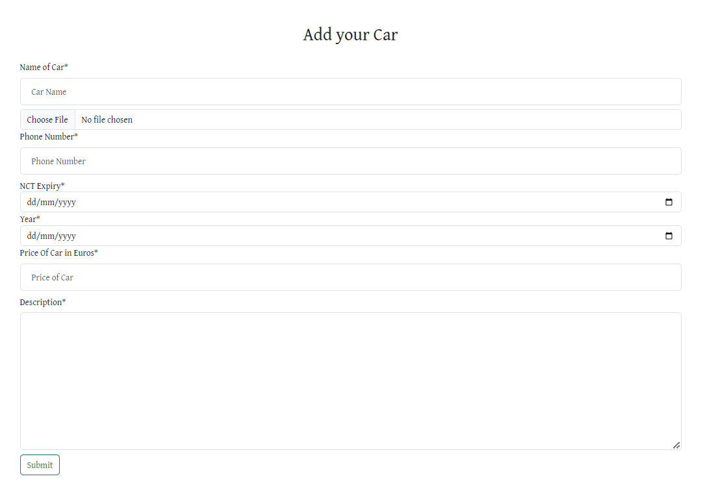</h2>

-   Page to add your post if you are logged in.

- Consist of Name of Car, Image, Phone-number, NCT, Year of Car, Price, and a Brief Description with a submit button.

 ### Features to edit Car
<h2 class="center">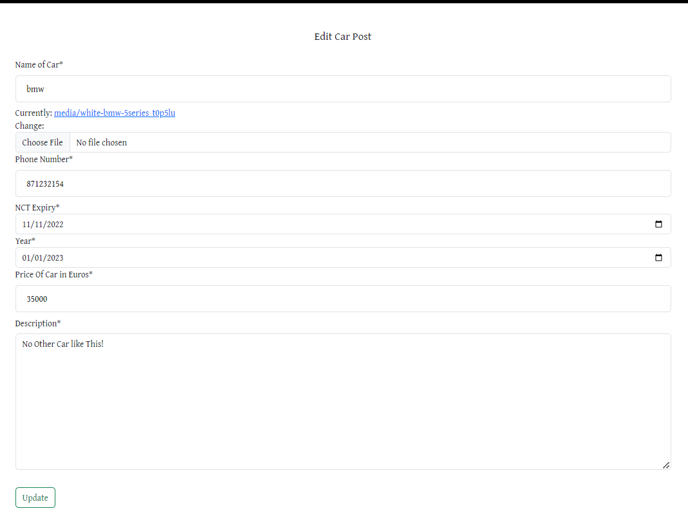</h2>

- A user can edit his car post and update to the Browse Car section .

 ### Delete Car Modal
<h2 class="center">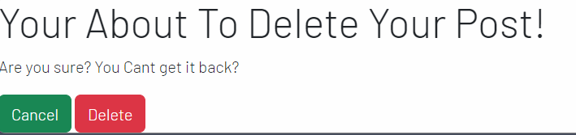</h2>

- A pop up modal appears when the user clicks delete car.

 ### Contact us
<h2 class="center">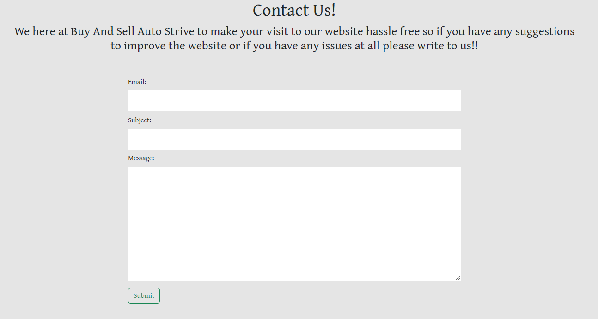</h2>

- Contact form for people to contact the admin to give feedback about the page or any issues that they might have.

#### Contact form admin

- Once this is Posted the Admin can look at these on the django admin page.
<h2 class="center">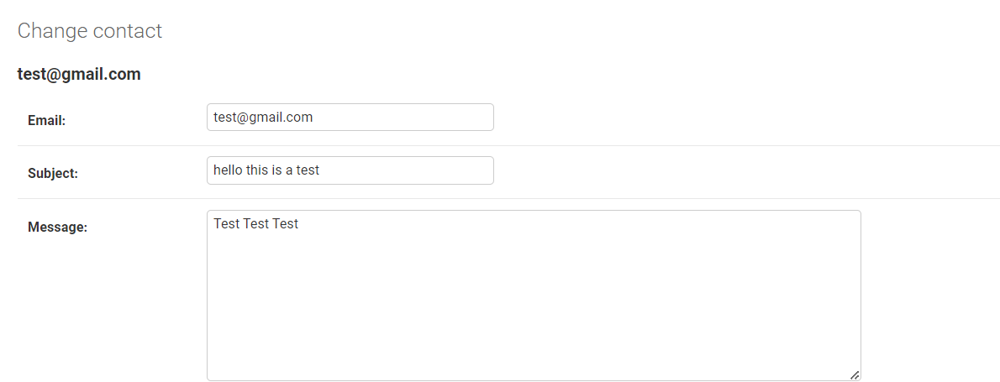</h2>

 ### Messages

<h2 class="center">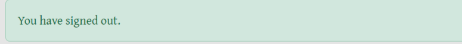</h2>

-   Messages are used like above for signing in, signing out, deleted car, adding car, editing car, commenting and also filling out the contact form. 

 ### Admin Page

 <h2 class="center">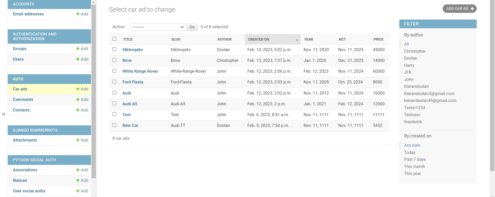</h2>

 - The admin page can filter thorugh all posts, comments and through the contact forms. The admin can approve comments onto the page and delete what is not appropriate. The admin can also look through thre feedback and issues that may arise from a user. 

## 404 Page

<h2 class="center">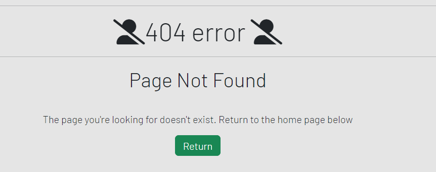</h2>

### Features to Add in the Future. 

- There is plenty of features i have in mind for this project and i wish i could of included more but with errors and time constraints i ran into problems. I will be putting these in after the grading. However the features i would include are:

- Profile log in so you can read about the user and possible see if they have sold cars on the site before.

- Contact Form sent to my email account along with my django admin account. I did try to include this feature but i was having
trouble with SendGrid who wouldn't authorise my email. [This link is what i tried to set it up with.](https://www.twilio.com/blog/build-contact-form-python-django-twilio-sendgrid). I will try this with gmail the simple mail transfer protocol (SMTP) in the future

- Signing up with Social Media Accounts.

- Search Bar that filters through cars.

- A feature to add multiple images and a video.

## Technologies

### Languages used

- [HTML5](https://en.wikipedia.org/wiki/HTML5)
- [CSS3](https://en.wikipedia.org/wiki/Cascading_Style_Sheets)
- [Javascript](https://en.wikipedia.org/wiki/JavaScript)
- [Python](https://www.python.org/)

### Libraries and Programs Used

- [Git](https://git-scm.com/)
    - Version control.
- [GitHub](https://github.com/)
    - For storing code and deploying the site.
- [Gitpod](https://www.gitpod.io/)
    - Used for building and editing my code.
- [Django](https://www.djangoproject.com/)
    - A python based framework that was used to develop the site.
- [Django-allauth](https://django-allauth.readthedocs.io/en/latest/installation.html)
    - A authentication library used to create the user accounts
- [Google Fonts](https://fonts.google.com/)
    - Used for getting fonts.
- [Bootstrap](https://getbootstrap.com/)
    - For help designing the html templates.
- [Font Awesome](https://fontawesome.com/)
    - Used to obtain the icons used.
- [Google Developer Tools](https://developers.google.com/web/tools/chrome-devtools)
    - Used to help fix problem areas and identify bugs.
- [Cloudinary](https://cloudinary.com/)
    - Used to store static files and images.
- [Favicon.io](https://favicon.io/)
    - Used to generate the site's favicon.
- [PostgreSQL](https://www.postgresql.org/)
    - Database used through heroku.
- [Coolors](https://coolors.co/) -
    - Used for colour palette
- [Lucidchart](https://lucid.app/)
    - Used for Data Schema
- [Balsamiq](https://balsamiq.com/)
    - To create the wireframes.
- [W3C Markup Validation Service](https://validator.w3.org/) 
    - Used to validate HTML code.
- [W3C CSS Validation Service](https://jigsaw.w3.org/css-validator/#validate_by_input)
    - Used to validate CSS code.
- [PEP8CI](https://pep8ci.herokuapp.com/)
    - Used to validate Python code.
- [JSHint](https://jshint.com/)
    - Used to validate JS code.
- [Summernote](https://summernote.org/)
    - Used to add a WYSIWYG text box.
- [Crispy Forms](https://django-crispy-forms.readthedocs.io)
    - Used for forms.
- [Heroku](https://www.heroku.com/)
    - To deploy the project.

### Database Security
I used an env.py file to protect all sensitive information.

Cross-Site Request Forgery (CSRF) tokens were used on all forms throughout this site.
## Testing 
This Project was tested manually.

Testing and results can be found [here](/TESTING.md)

# Deployment

## Heroku

To deploy this page to Heroku from its GitHub repository, the following steps were taken:

### Create the Heroku App:
- Log in to [Heroku](https://dashboard.heroku.com/apps) or create an account.
- On the main page click the button labelled New in the top right corner and from the drop-down menu select "Create New App".
- Enter a unique and meaningful app name.
- Next select your region.
- Click on the Create App button.

### Attach the Postgres database:
- In the Resources tab, under add-ons, type in Postgres and select the Heroku Postgres option.
- Copy the DATABASE_URL located in Config Vars in the Settings Tab.

### Prepare the environment and settings.py file:
- In your GitPod workspace, create an env.py file in the main directory.
- Add the DATABASE_URL value and your chosen SECRET_KEY value to the env.py file. 
- Update the settings.py file to import the env.py file and add the SECRETKEY and DATABASE_URL file paths.
- Comment out the default database configuration.
- Save files and make migrations.
- Add Cloudinary URL to env.py
- Add the cloudinary libraries to the list of installed apps.
- Add the STATIC files settings - the url, storage path, directory path, root path, media url and default file storage path.
- Link the file to the templates directory in Heroku.
- Change the templates directory to TEMPLATES_DIR
- Add Heroku to the ALLOWED_HOSTS list the format ['app_name.heroku.com', 'localhost']

### Create files / directories
- Create requirements.txt file
- Create three directories in the main directory; media, storage and templates.
- Create a file named "Procfile" in the main directory and add the following: web: gunicorn project-name.wsgi

### Update Heroku Config Vars
Add the following Config Vars in Heroku:
- SECRET_KEY value 
- CLOUDINARY_URL
- PORT = 8000
- DISABLE_COLLECTSTATIC = 1

### Deploy
- NB: Ensure in Django settings, DEBUG is False
- Go to the deploy tab on Heroku and connect to GitHub, then to the required repository. 
- Scroll to the bottom of the deploy page and either click Enable Automatic Deploys for automatic deploys or Deploy Branch to deploy manually. Manually deployed branches will need re-deploying each time the repo is updated.
- Click View to view the deployed site.

The site is now live and operational.
## Forking this repository
- Locate the repository at this link [Buy and Sell Auto](https://buy-and-sell-auto.herokuapp.com/).
- At the top of the repository, on the right side of the page, select "Fork" from the buttons available. 
- A copy of the repository is now created.

## Cloning this repository
To clone this repository follow the below steps: 

1. Locate the repository at this link [Buy and Sell Auto](https://github.com/Kierandoolan/buy-and-sell-auto-project-four). 
2. Under **'Code'**, see the different cloning options, HTTPS, SSH, and GitHub CLI. Click the prefered cloning option, and then copy the link provided. 
3. Open **Terminal**.
4. In Terminal, change the current working directory to the desired location of the cloned directory.
5. Type **'git clone'**, and then paste the URL copied from GitHub earlier. 
6. Type **'Enter'** to create the local clone. 
    For more information on cloning check out the github documentation [here](https://docs.github.com/en/repositories/creating-and-managing-repositories/cloning-a-repository)

## Credits

### Content

-   All content was written by the developer with the help of Code insitute Walkthroughs and the help of my collegues on slack and tutors. Big thank you to them!

### Acknowledgements

-   My Mentor for continuous helpful feedback.

-   Tutor support at Code Institute for their support.

-   The Teachers at Code Institude for helpful videos and walk through project

-   My collegues on the slack app who helped me when i had any issues.

-   Also to my military work collegues who i'm sharing a room with for the last 4 months in Lebanon for their patiences with me during my time doing this. 

 ### Other

- I came to realised i have not commited my work as much as i should of. On one of my projects i committed too much and now as i come to the end of these i regret that i didn't commit my work as much as i could of. 

- In this work i felt i could of gave more. I made some big errors but from these errors i learnt alot and it makes me feel more comfortable about how everything works within the project. I hope after this i can continue the work of it to make it more useful for a real world application.

 ## Media
 - ALL my pictures are from a stock site called [Pexels](www.pexels.com)

