## WW3C Validator

### Errors in Contact Form and Edit Form
<h2 class="center">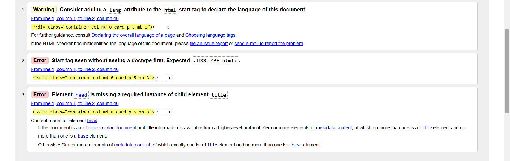</h2>

- In the Contact Form and Edit Form i ran into errors as you can see above. 

- This was when i used text input to check the problems on the page so it doesnt see the "base" of the pages hence the error.

- If i used the address input to check the problems on the page i will also get errors which is forms because of the djangos lay out of the form. 

- I hope these are valid reasons for keeping them as they are as you read through the rest of the validations below. 

### Index
<h2 class="center">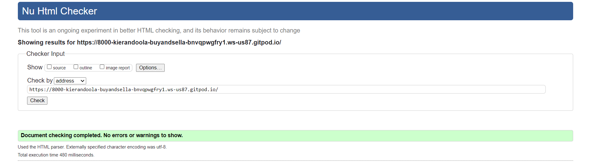</h2>

- index page [here]

### Browse Cars
<h2 class="center">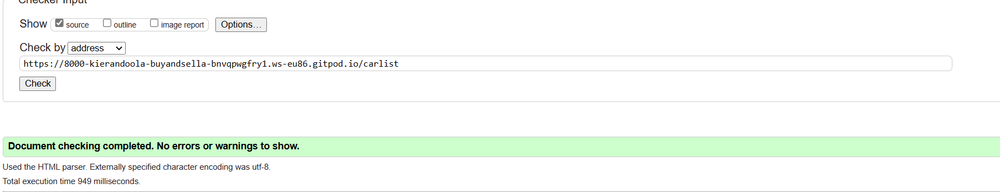</h2>

Carpage [here]

### Car Detail
<h2 class="center">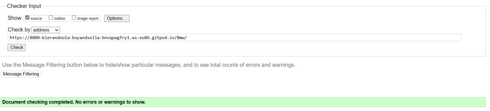</h2>

### Contact Form (Errors as Explained)
<h2 class="center">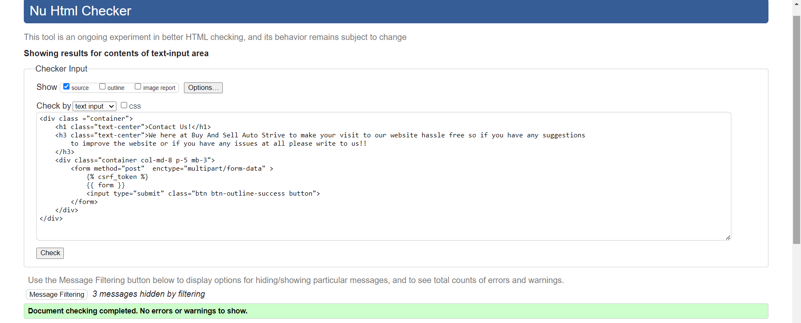</h2>

- Errors Explained at start

### Add Car
<h2 class="center">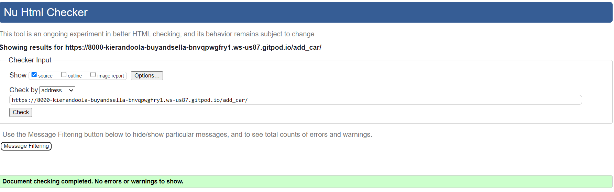</h2>

### Edit Car (Errors as Explained)
<h2 class="center">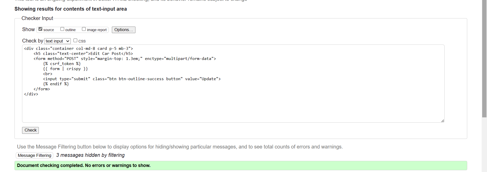</h2>

Errors explained at the start

### Log In
<h2 class="center">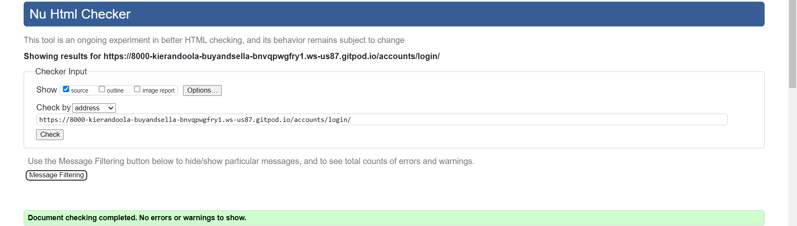</h2>

### -Sign Up
<h2 class="center">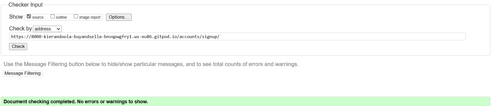</h2>

### Sign Out
<h2 class="center">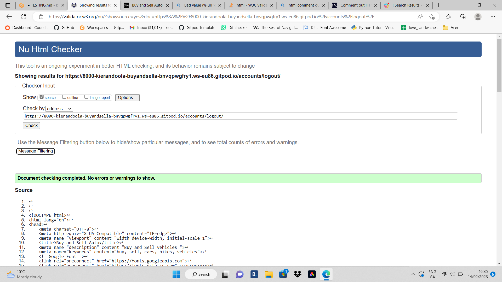</h2>

### Jigsaw css validator

<h2 class="center"></h2>
RESULT: Congratulations! No Error Found

### PEP8CI 

<h2 class="center">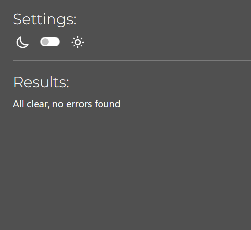</h2>

- Results: All clear, no errors found (except settings.py)

- I had to leave the "AUTH_PASSWORD_VALIDATORS" in settings.py as "line too long" as it was causing trouble adding a new superuser and also changing password. 

## Manual Test

Manual Testing was done to see if everything worked:

| Element               | Action     | Expected Result                                                    | Pass/Fail |
|-----------------------|------------|--------------------------------------------------------------------|-----------|
| NavBar                |            |                                                                    |           |
| Site Brand (logo)     | Click      | Redirect to home                                                   | Pass      |
| Home Link             | Click      | Redirect to home                                                   | Pass      |
| Browse Cars Link            | Click      | Open Browse Cars Page page                                                    | Pass      |
| Contact link       | Click      | Open Contact page                                               | Pass      |
| Add Car link          | Click      | Open Add Car page                                                  | Pass      |      |
| Log In Link      | Click      | Open Log In Page                                          | Pass      |
| Register Link   | Click    | Open Register Page                           | Pass      ||
| Logout Link           | Click      | Open logout confirm page                                           | Pass      |
| Logout Link           | Display    | Only visible if user is logged in                                  | Pass      |
| Log In Link           | Display    | Not visible if user logged in                                      | Pass      |
| All Nav Links         | Hover      | lighten text                                                       | Pass      |
| Mobile View           |            |                                                                    |           |
| Hamburger Menu        | Responsive | Display when screen size reduces to medium size                       | Pass      |
| My Account Dropdown   | Responsive | Contents move into hamburger menu when screen size reduces to medium           | Pass      |
| Site Name (logo area) | Click      | Redirect to home                                                   | Pass      |
| Home Link             | Click      | Redirect to home                                                   | Pass      |
| Browse Cars Link   | Click      | Open Browse Cars Page                                           | Pass      |
| Sign Up Link          | Click      | Open Sign up page                                                  | Pass      |
| Sign Up Link          | Display    | Not visible if user in session                                     | Pass      |
| Log In Link           | Click      | Open Login page                                                    | Pass      |
| Log In Link           | Display    | Not visible if user in session                                     | Pass      |
| Add Car Link       | Click      | Open Add Car Form                                               | Pass      |
| Add Car Link       | Display    | Only visible if user is signed in                                   | Pass      |
| Contact link       | Click      | Open Contact page                                               | Pass      |
| Logout Link           | Click      | Open logout confirm page                                           | Pass      |
| Logout Link           | Display    | Only visible if user in session                                    | Pass      |

### Home Page
| Element               | Action  | Expected Result                 | Pass/Fail |
|-----------------------|---------|---------------------------------|-----------|
| Browse Cars Button      | Click   | Open Browse Car page                  | Pass      |
| Entire page           | Display | Responsive and readable         | Pass      |

### Browse Car Page
| Element               | Action  | Expected Result                 | Pass/Fail |
|-----------------------|---------|---------------------------------|-----------|
| Car Ad cards       | Click   | Click on body opens Car Ad | Pass      |
| Car Ad Card | Pagination              | Site will paginate 12 recipe cards to a page                                             | Pass      |
| Car Ad Card | Order                   | Recipes are sorted by newest to oldest                                                  | Pass      |
| Car Ad Card | Hover                   | Add Orange to car name                                                                         | Pass      |

### Car Ad Detail
| Element                        | Action              | Expected Result                                                                                                         | Pass/Fail |
|--------------------------------|---------------------|-------------------------------------------------------------------------------------------------------------------------|-----------|
| Car Content                 | Display             | Display correct  image, title, author, year, phone-number, price, description and nct                 | Pass      |
| Update Car button           | Click               | Opens Update Car Form                                                                                                | Pass      |
| Update Car button           | Display             | Button only visible if user is the author                                                                               | Pass      |
| Delete Car button           | Click     |          Modal Car                         
                                                            | Pass      |
| Delete Car button           | Display             | Button only visible if user is the author                                                                               | Pass      |
| User Comments                  | Display             | Displays correct name date time and comment body                                                                        | Pass      |                                                                                
| Delete comment button          | Display             | Button only visible if user is the comment author                                                                       | Pass      |
| Confirm delete button          | Click               | Comment is removed from comment section                                                                                 | Pass      |
| Confirm delete button          | Click               | Success message fades after 3 seconds                                                                                   | Pass      |e button           | Click               | Redirect user back to recipe page                                                                                       | Pass      |
| Add comment Form               | Display             | Form only visible if user is logged in                                                                                  | Pass      |
| Add comment Form submit button | Leave empty               | On submit: form won't submit                                                                                            | Pass      |
| Add comment Form submit button | Leave empty               | Error message displays                                                                                                  | Pass      |
| Add comment Form submit button | Filled in               | Form submit - page updates and comment displays in comments section with correct content                                | Pass      |
| Add comment Form submit button | Click               | Success message appears informing the user that the comment has been added                                              | Pass      |
| Add comment Form submit button | Click               | Success message fades after 3 seconds  

### Add Car Page
| Element                       | Action                | Expected Result                                                                                                     | Pass/Fail |
|-------------------------------|-----------------------|---------------------------------------------------------------------------------------------------------------------|-----------|
| Form Text Input (if required) | Leave blank           | On Submit: Warning appears, form won't submit                                                                       | Pass      |
| Form Text Input (if required) | Just input whitespace | On Submit: Form won't submit                                                                                        | Pass      |
| Car Title                  | Duplicate Entry       | On Submit: Warning appears, form won't submit                                                                       | Pass      |
| Form image select button      | Click                 | Open device storage                                                                                                 | Pass      |
| Form image select button      | Display               | Chosen image name displayed once selected                                                                           | Pass      |                                                        | Pass      |                                                                                | Pass      |
| Add Car Submit button(form valid) | Click                 | Form submit                                                                                                         | Pass      |
| Add Car Submit button(form valid) | Click                 | Redirect to Car Ad detail page with all information displaying correctly                             | Pass      |
| Add Car Submit button(form valid) | Click                 | Success message appears informing the user that the car has been created                                         | Pass      |
| Add Car Submit button(form valid) | Click                 | Success message fades after 3 seconds                                                                               | 

### Edit Car Add Page
| Element            | Action  | Expected Result                                                                                                         | Pass/Fail |
|--------------------|---------|-------------------------------------------------------------------------------------------------------------------------|-----------|
| Update Car Form | Display | Form has all the fields filled out with the original content                                                            | Pass      |
| Update Button      | Click   | Updated Car is saved                                                                                                 | Pass      |
| Update Button      | Click   | Success message appears telling the user that the car has been successfully updated                                  | Pass      |
| Update Button      | Click   | Success message fades after 3 seconds                                                                                   | Pass      |
| Update Button      | Click   | User is redirected back to the current car page                                                                      | Pass      |

### Django Sign In, Sign Up, Sign out Pages
| Element                    | Action                                    | Expected Result                            | Pass/Fail |
|----------------------------|-------------------------------------------|--------------------------------------------|-----------|
| Sign Up                    |                                           |                                            |           |
| Log in link                | Click                                     | Redirect to login page                     | Pass      |
| Username field             | Leave empty                               | On submit: form won't submit               | Pass      |
| Username field             | Leave empty                               | Error message displays                     | Pass      |
| Username field             | Insert correct format                     | On submit: form submit                     | Pass      |
| Username field             | Insert duplicate username                 | On submit: form won't submit               | Pass      |
| Username field             | Insert duplicate username                 | Error message displays                     | Pass      |
| Email field                | Insert incorrect format                   | On submit: form won't submit               | Pass      |
| Email field                | Insert incorrect format                   | Error message displays                     | Pass      |
| Email field                | Insert correct format                     | On submit: form submit                     | Pass      |
| Email field                | Leave empty                               | On submit: form submit                     | Pass      |
| Email field                | Insert duplicate email                    | On submit: form won't submit               | Pass      |
| Email field                | Insert duplicate email                    | Error message displays                     | Pass      |
| Password field             | Insert incorrect format                   | On submit: form won't submit               | Pass      |
| Password field             | Insert incorrect format                   | Error message displays                     | Pass      |
| Password field             | Passwords don't match                     | On submit: form won't submit               | Pass      |
| Password field             | Passwords don't match                     | Error message displays                     | Pass      |
| Password field             | Insert correct format and passwords match | On submit: form submit                     | Pass      |
| Sign Up button(form valid) | Click                                     | Form submit                                | Pass      |
| Sign Up button(form valid) | Click                                     | Redirect to home page                      | Pass      |
| Sign Up button(form valid) | Click                                     | Success message confirming login appears   | Pass      |
| Sign Up button(form valid) | Click                                     | Success message fades after 3 seconds      | Pass      |
|                            |                                           |                                            |           |
| Log in                     |                                           |                                            |           |
| Sign up link               | Click                                     | Redirect to sign up page                   | Pass      |
| Username field             | Leave empty                               | On submit: form won't submit               | Pass      |
| Username field             | Leave empty                               | Error message displays                     | Pass      |
| Username field             | Insert wrong username                     | On submit: form won't submit               | Pass      |
| Username field             | Insert wrong username                     | Error message displays                     | Pass      |
| Password field             | Leave empty                               | On submit: form won't submit               | Pass      |
| Password field             | Leave empty                               | Error message displays                     | Pass      |
| Password field             | Insert wrong password                     | On submit: form won't submit               | Pass      |
| Password field             | Insert wrong password                     | Error message displays                     | Pass      |
| Login button(form valid)   | Click                                     | Form submit                                | Pass      |
| Login button(form valid)   | Click                                     | Redirect to home page                      | Pass      |
| Login button(form valid)   | Click                                     | Success message confirming login appears   | Pass      |
| Login button(form valid)   | Click                                     | Success message fades after 3 seconds      | Pass      |
|                            |                                           |                                            |           |
| Log Out Confirmation       |                                           |                                            |           |
| Logout button              | Click                                     | Redirect to homepage                       | Pass      |
| Logout button              | Click                                     | Success message confirming log out appears | Pass      |
| Logout button              | Click                                     | Success message fades after 3 seconds      | Pass      |

## Issues fixed.

### Validator
- There was a few silly mistakes in the WW3C validator for Html but they were quickly fixed,.

### Car Detail Page
<h2 class="center">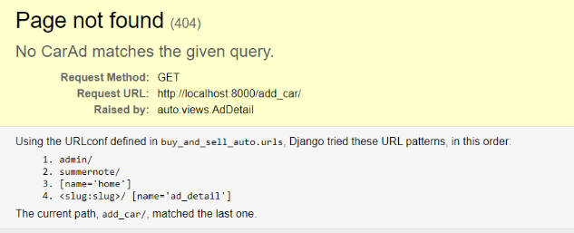</h2>

- I Kept get this error when going into carDetail. However with a little bit of research and help i found out its to do with my urls.py. They were all in an unordered fashion. So i reorder my paths so that the most ambiguous paths come at the end.

### Form Page
<h2 class="center">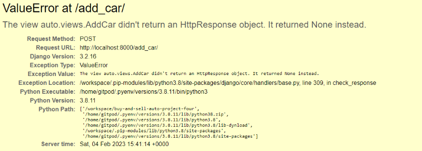</h2>

- When testing on an Iphone on the I kept getting valueError on it although it was working perfectly on the desktop. 
 When changing the forms fields around it worked.

### No Slug in Add
<h2 class="center">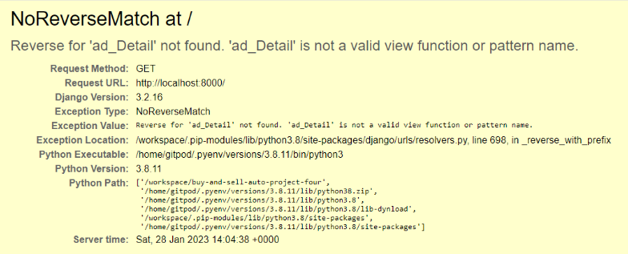</h2>

I was having trouble clicking into an Ad posted. The issue was the ad didnt have a slug so the bottom image was added with the help of a tutor. 
<h2 class="center"></h2>

## Issues not fixed.

### SendGrid Emails

 I tried to add a contact form that sends to admin email address via SendGrid but i ran into trouble.
 <h2 class="center">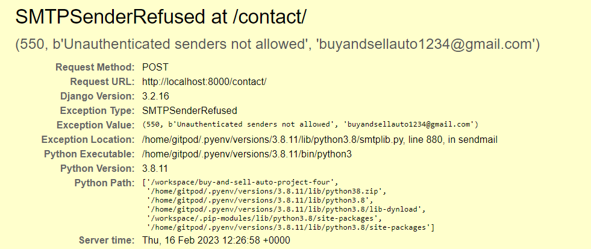</h2>

- I was looking on Stackoverflow for answers and help. I tried i few ideas that were there but unfortunlately i ran out of time. At the end of these i will look into it deeper to find a solution. 

<h2 class="center">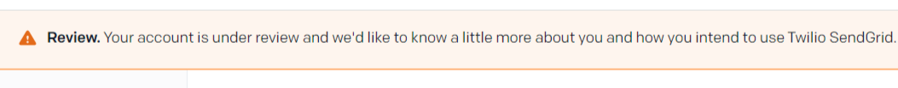</h2>

-   It could be possible they needed to validated me on the website which i tried but no reply and i unfortunlately ran out of time. 

### Log in with social media. 

- I tried to do log in with social media which included facebook, twitter and github. I did this with help of [studygyaan] (https://studygyaan.com/django/how-to-add-social-login-to-django)
I could reach the third party website and when i clicked contintue it would come up with "localhost refused to connect." Tried multiply ways to fix this but I also ran out of time. 

- I hope to also come back and fix this in a later stage. 

